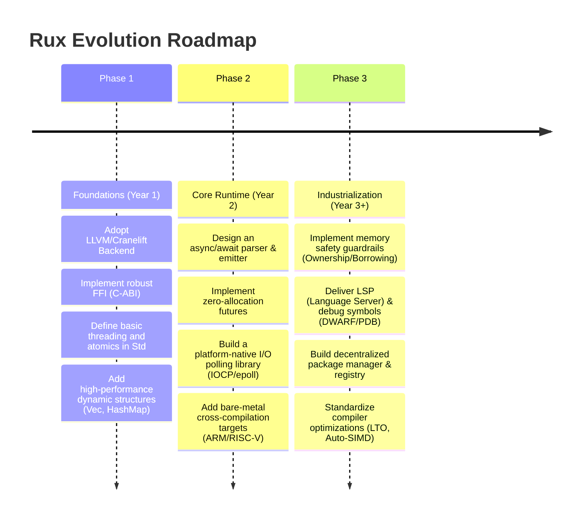

# Rux Programming Language: Complete Technical Gap Analysis

This document provides a highly technical, realistic, and objective evaluation of the Rux programming language (currently at v0.2.0) compared against established systems programming languages like Rust, Zig, C++, and Go. Rux's ambition to be a "metal-friendly" systems language with zero overhead requires overcoming substantial engineering and ecosystem hurdles before it can be considered production-ready.

---

## 1. Core Language Ecosystem Gaps

Rux is in its infancy. The following core ecosystem components are either entirely missing, highly immature, or theoretical:

* **Standard Library (`Std`) Completeness**: The standard library is extremely minimal. It lacks essential data structures (such as HashMaps, trees, concurrent queues, and ring buffers), advanced string manipulation (regex, Unicode normalization), and standard algorithms (sorting, searching, hashing).
* **Package Manager Maturity**: The built-in package manager lacks critical features for modern package management: decentralized registries, dependency lockfiles (equivalent to `Cargo.lock`), reproducible builds, and vulnerability auditing.
* **Dependency Resolution**: Advanced dependency resolution algorithms (e.g., PubGrub used by Cargo) to handle complex version constraints, peer dependencies, and diamond dependency conflicts are completely missing.
* **Compiler Architecture**: The custom C++ compiler does not benefit from the decades of optimization passes present in LLVM, GCC, or Cranelift. The custom backend means the project must maintain architecture-specific emitters (x86-64, ARM64, RISC-V) from scratch, severely slowing platform expansion.
* **Linker and ABI Support**: Rux relies on a custom `.rcu` format and a bespoke linker. Integration with standard linkers (LLD, GNU ld, mold) and generating debugging information (DWARF, PDB) is immature or non-existent, complicating C/C++ FFI and debugging.
* **Memory Management Model**: Rux uses raw pointers (`*T`) and references (`&T`) without a borrow checker. It offers manual C-style memory management without the compile-time safety of Rust or the spatial safety of Zig's allocator patterns.

---

## 2. Runtime & Concurrency Layer Gaps

A true systems programming language candidate needs a robust concurrency story. Currently, Rux lacks any native concurrency model:

* **Asynchronous Runtime**: There is no built-in async runtime. Standard primitives like futures, polling mechanisms, and event loop integration (like `epoll`, `kqueue`, or Windows IOCP) are missing.
* **Green Threads & Scheduler**: A work-stealing M:N scheduler (like Go's goroutines) does not exist. Implementing one would require a runtime that handles stack allocation/growing and context switching.
* **Async/Await Syntax & State Machines**: Rux lacks `async`/`await` keywords. Compiling asynchronous functions into zero-allocation state machines (similar to Rust) is not supported by the current parser and compiler backend.
* **Multithreading & Atomics**: The standard library does not expose threading APIs or memory barriers/atomics (`std::atomic` equivalents). Concurrency is restricted to calling Windows APIs directly via FFI, exposing developers to unsafety.

---

## 3. Missing Standard Libraries

To compete with mature systems languages, Rux needs a production-grade suite of libraries:

| Library Domain | Current Rux v0.2.0 State | Required for Production |
| :--- | :--- | :--- |
| **Collections** | Array, Slice | HashMap, BTreeMap, HashSet, Vec, LinkedList |
| **I/O & Filesystem** | `Std::Io` (Print, PrintLine) | Buffered Reader/Writer, Directory Traversal, File Metadata, Async I/O |
| **Networking** | None | TCP/UDP Sockets, TLS 1.3, HTTP/1.1 & HTTP/2 Stack, DNS Resolver |
| **Cryptography** | None | SHA-256/3, AES-GCM, ChaCha20-Poly1305, Ed25519, Randomness (BCryptGenRandom/getrandom) |
| **Time & DateTime** | None | High-resolution Monotonic Clock, Calendar Time, Timezone Database |

---

## 4. Developer Tooling Gaps

Tooling makes or breaks a language. Rux lacks the necessary developer utility suite:

* **Language Server (LSP)**: No LSP exists. Syntax highlighting is limited to VSCode/Sublime regex matching. Modern IDE features (autocomplete, hover types, go-to-definition, refactoring, and linting) are completely missing.
* **Build System Integrations**: Rux's build system cannot parse nested package structures, manage build scripts, or run custom build-time code generation.
* **Debugger Support**: The lack of standard DWARF/PDB generation means `gdb`, `lldb`, and `Visual Studio Debugger` cannot inspect Rux variables, map binary offsets back to source lines, or print stack traces.
* **Formatter & Linter**: There is no official formatter (like `rustfmt` or `zig fmt`) or static analysis linter (like `clippy`), leading to code formatting fragmentation.

---

## 5. Production-Grade Architecture Gaps

For industrial adoption, Rux must support robust systems architectures:

* **Error Handling**: Currently, Rux uses a basic `Result` type but lacks syntactic sugar (like Rust's `?` operator or Zig's `try`) and compile-time stack-trace tracking, leading to boilerplate-heavy error propagation.
* **Metaprogramming & Macros**: No macro system (declarative or procedural) exists. Generics are limited and do not support compile-time function execution (CTFE) or template specialization.
* **Reflection**: There is no runtime or compile-time reflection, making serialization/deserialization (e.g., JSON, Protocol Buffers) manual and error-prone.
* **Cross-Compilation**: The compiler is hardcoded to output Windows PE format on x86-64. There is no simple target flag (like `zig build -target x86_64-linux`) for cross-compilation.

---

## 6. System Readiness Across 10 Key Domains

The table below outlines Rux's readiness across 10 critical systems programming domains:

| Domain | Readiness | Primary Gaps |
| :--- | :--- | :--- |
| **1. Operating Systems** | 🔴 5% (Unusable) | No `no_std` mode; custom linker outputs only Windows PE; lacks linker script control. |
| **2. Compilers** | 🟡 30% (Basic) | Basic structs and generics work, but lacks recursive types, algebraic enums, and tree pattern matching. |
| **3. Runtime Engines** | 🔴 10% (Unusable) | No FFI memory protection (VirtualProtect); lack of function pointer casting; no GC root tracing. |
| **4. Database Engines** | 🔴 10% (Unusable) | Lacks File I/O (`fsync`), memory-mapped files (`mmap`), and lock/mutex primitives for buffer pools. |
| **5. Game Engines** | 🔴 15% (Unusable) | No SIMD intrinsics; lacks bindings to Graphics APIs (Vulkan/DirectX/OpenGL); no dynamic array (Vec). |
| **6. Embedded Systems** | 🔴 5% (Unusable) | Target restricted to Windows x86-64; no bare-metal ARM/RISC-V cross-compilers; no volatile registers. |
| **7. Networking Stack** | 🔴 5% (Unusable) | No socket API; lacks asynchronous polling (IOCP/epoll) and raw byte buffers. |
| **8. CLI Tools** | 🟡 40% (Feasible) | Can print to stdout, but lacks argument parsing, environment variable readers, and subprocess launching. |
| **9. Virtualization** | 🔴 5% (Unusable) | Lacks platform-specific hypervisor FFI (WHPX/KVM) and structures for page-table mappings. |
| **10. Drivers** | 🔴 5% (Unusable) | Cannot output `.sys` or `.ko` binaries; no kernel-mode FFI; cannot handle interrupts. |

---

## 7. Security Gaps

Modern systems languages must be secure by default. Rux is highly vulnerable to classic memory bugs:

* **Spatial Safety**: No bounds checking on slices and raw pointers. Buffer overflows are trivial to trigger.
* **Temporal Safety**: No borrow checker, reference counting, or lifetime tracking. Use-after-free, double-free, and dangling pointers are common hazards.
* **Data Races**: No compiler-enforced thread-safety markers (like Rust's `Send` and `Sync`). Data races are undetected at compile-time.
* **Undefined Behavior (UB)**: Rux has no strict definition of Undefined Behavior. The custom compiler might optimize or emit instructions that cause erratic, silent hardware failures.

---

## 8. Performance Gaps

Rux aims to be fast, but its current pipeline contains several performance bottlenecks:

* **Compiler Optimizations**: The C++ backend lack basic optimizations like Loop Unrolling, Vectorization (auto-SIMD), Dead Code Elimination (DCE), Link-Time Optimization (LTO), and Devirtualization of interface calls.
* **Allocator Overhead**: The default allocator relies on Windows HeapAlloc/CoTaskMemAlloc without local thread caches (like jemalloc or mimalloc), causing severe lock contention under multithreaded loads.
* **ABI Overhead**: The lack of a defined ABI means Rux to C FFI involves copying structs on the stack rather than passing them in registers, causing FFI boundary overhead.

---

## 9. Multi-Year Roadmap for Rux (v0.2.0 to Production Ready)

To transition Rux from an experimental compiler to a competitive systems language, the community should focus on a structured 3-phase roadmap:

### Phase 1: Foundations & Backend (Year 1)

1. **Backend Migration**: Transition the compiler from a custom C++ emitter to **LLVM** or **Cranelift**. This instantly provides decades of industrial-grade optimizations and multi-platform support.
2. **C-ABI Compatibility**: Standardize the ABI layout for structs and functions, allowing seamless, high-performance interop with C/C++ libraries.
3. **Basic Threading & Atomics**: Add core operating system thread management and atomic instructions to the standard library.

### Phase 2: Asynchronous Runtime & Cross-Compilation (Year 2)

1. **Async Engine**: Introduce the `async`/`await` keywords. Modify the compiler's frontend to transform async functions into zero-allocation state machines.
2. **Event Loops**: Implement a core polling network library using Windows IOCP, Linux epoll, and macOS kqueue.
3. **No-Std & Cross-Compilation**: Add target configurations for bare-metal compilers (e.g., `thumbv7em-none-eabihf`), separating the core language from the OS allocator and standard library.

### Phase 3: Developer Experience & Safety (Year 3+)

1. **LSP & Tooling**: Develop an official Language Server and integrate with debugger formats (DWARF/PDB) to allow native breakpoints and watchpoints.
2. **Safety Guardrails**: Introduce a memory safety model. Whether through compile-time ownership tracking (like Rust), safe-by-default references (like Zig), or safe compile-time reference counting.
3. **Ecosystem Registry**: Launch the official package manager registry with strict SemVer enforcement, lockfile support, and build caching.
